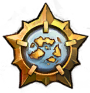

<p align="center">

<h1 align="center">FFXIV Trivia</h1>
</p>

## Background

Used the skeleton of my [Guild Wars 2 Geoguesser](https://github.com/maael/gw2-geoguesser) project, but with the goal of challenges with FFXIV trivia rather than geoguessing.

## Development

```sh
git clone git@github.com:maael/gw2-geoguesser.git
cd gw2-geoguesser
yarn
yarn dev
```

## Design Thoughts

### Technologies

- MongoDB
- Next.js
  - Hosted on Vercel

### Account / Users

Considered using Discord / Reddit accounts, but users may not want to use them, and also Discord linked accounts have issues with keeping the display pictures up to date (the display pictures go after an amount of time, seen on past projects).

Taking a note from Hyrule Guesser, we'll roll our own minimal user/password system here. We don't need it to be anything super deluxe. Display pictures will be generated things too, similar to Hyrule Guesser. Maybe commission so basic SVG parts that we can mix together for the different races some time or something.

### Todo

- [ ] Make questions with multiple answers work as expected
- [ ] Add more questions
- [ ] Change to Sprout/Normal/Hard/Extreme/Savage (or three tiers with suitable mixes of question difficulties) and Daily/Weekly challenges, rather than single tier Daily/Weekly/Monthly challenges
